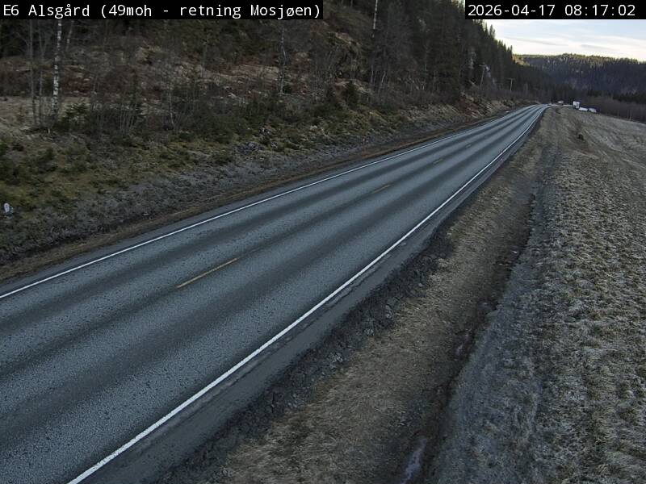
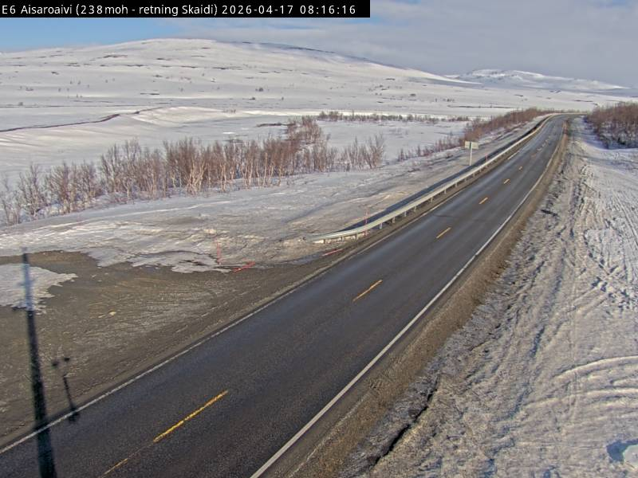
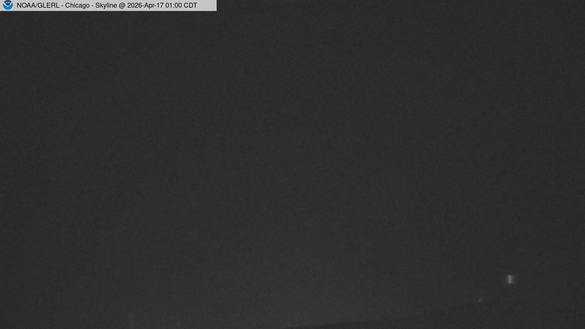

# Camera proof

The skywatch GitHub Pages site at [ruddro-roy.github.io/skywatch](https://ruddro-roy.github.io/skywatch/#camera) runs this check live in the browser every time the page loads. It pulls a fresh frame from each public camera and a fresh current-conditions reading from Open-Meteo for the same coordinates, and shows them side by side. Reload the page and you get a new pair.

The images stored in `docs/cameras/` are a point-in-time snapshot kept only for people who want to see what the check looked like on April 17, 2026 without hitting the live URLs.

## Feeds used

Only sources that allow public redistribution are used. No scraping, no unsecured cameras.

| Camera | Coordinates | Source | License |
|---|---|---|---|
| E6 Alsgård, Nordland, Norway | 65.83 N, 13.31 E | [kamera.atlas.vegvesen.no/api/images/3000946_1](https://kamera.atlas.vegvesen.no/api/images/3000946_1) | Statens vegvesen, NLOD (Norwegian Licence for Open Government Data) |
| E6 Aisaroaivi, Finnmark, Norway (near 70°N) | 70.28 N, 24.59 E | [kamera.atlas.vegvesen.no/api/images/2000065_2](https://kamera.atlas.vegvesen.no/api/images/2000065_2) | Statens vegvesen, NLOD |
| NOAA GLERL Chicago, Harrison-Dever Crib | 41.98 N, -87.59 E | [glerl.noaa.gov/metdata/chi/chi01.jpg](https://www.glerl.noaa.gov/metdata/chi/chi01.jpg) | NOAA, public domain (U.S. federal government) |

The current conditions come from Open-Meteo's free API at `api.open-meteo.com/v1/forecast`, no key required.

## Archived snapshot from April 17, 2026

These are stored for reference only. The live page does not use them.

- Frame timestamp: `2026-04-17 08:17:02`
- Visual: daylight, dry road, thin high cloud, coniferous forest, no precipitation
- Open-Meteo at capture minute: `3.6 °C`, feels like `1.1 °C`, `29%` cloud, `70%` humidity, `1.4 km/h` wind, WMO code `1` (mainly clear)

- Frame timestamp: `2026-04-17 08:16:16`
- Visual: arctic tundra, heavy snow on ground, cleared road, mixed sun and high cloud
- Open-Meteo at capture minute: `2.1 °C`, feels like `-0.5 °C`, `80%` cloud, `96%` humidity, `5.4 km/h` wind, WMO code `3` (overcast)

- Frame timestamp: `2026-04-17 01:00 CDT`
- Visual: night, near-black, a single distant light
- Station's own readings: `6.7 °C` air, `6.8 °C` dew point, `100%` RH, `0.0 kts` wind. Dew point equal to air temperature at 100% humidity is a fog signature; the dark featureless frame is what you would expect.

Full capture metadata in [docs/cameras/readings.json](docs/cameras/readings.json).

## What we do not use

Insecam, Opentopia, or any aggregator of unsecured or default-password IP cameras. Those cameras have not consented to public access. See [docs/LEGAL.md](docs/LEGAL.md).
