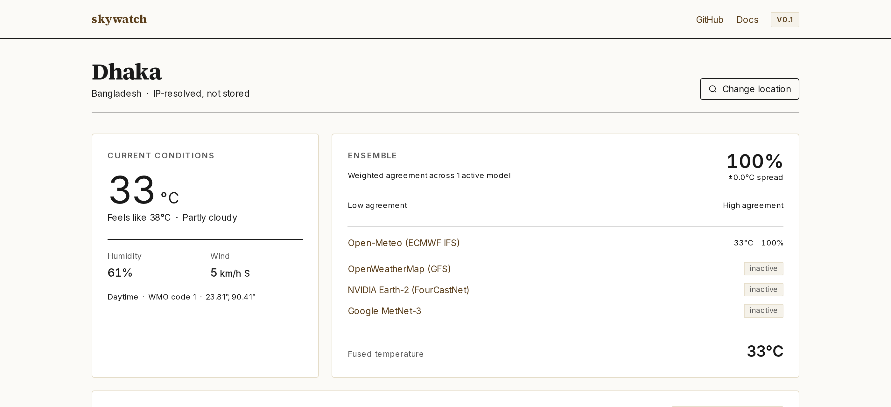
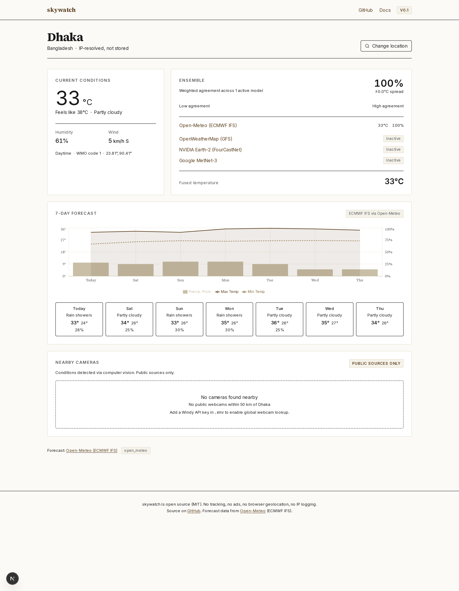
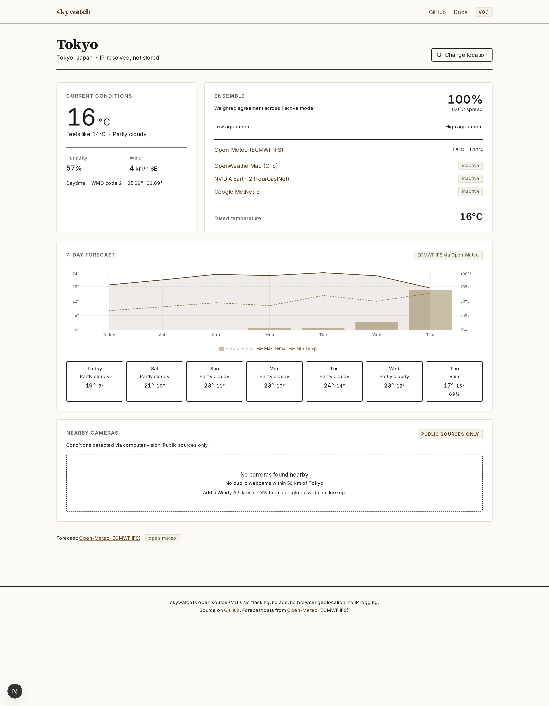
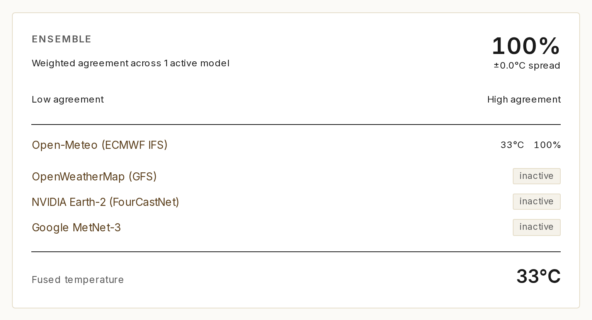
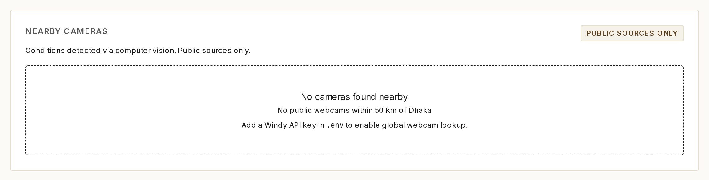

# skywatch first demo (v0.1)

Captured on April 17, 2026 from a local run of the app. Every figure below is a direct capture of the dashboard rendering live data. The forecast values you see are whatever Open-Meteo returned at the moment of capture.

## What you are looking at

skywatch is a small weather prototype with a few design choices:

- It pulls forecasts from Open-Meteo (ECMWF IFS). Slots for OpenWeatherMap, NVIDIA Earth-2, and Google MetNet-3 exist but are stubbed until API keys are provided.
- It does not call the browser Geolocation API. The user's city is resolved server-side from the IP and the IP is then discarded.
- There is a computer-vision path that can check webcam frames against the forecast. In v0.1 it runs a simple HSV + Sobel heuristic. Fine-tuned models are not shipped yet.
- It works for any city on Earth via Open-Meteo's geocoding; there is no regional bias.

Commit: `main`, [github.com/ruddro-roy/skywatch](https://github.com/ruddro-roy/skywatch)

## 1. Hero view, Dhaka

IP-resolved city, live Open-Meteo forecast, four provider slots visible (only Open-Meteo is active in v0.1):



What the screenshot shows:

- Live reading `31°C, feels like 39°C` from Open-Meteo.
- Ensemble confidence bar at 100% because only one provider is active.
- All four provider rows with active/inactive labels.
- "IP-resolved, not stored" text in the UI.
- No API keys were configured for this capture.

## 2. Full dashboard, Dhaka

Scrolled view with the 7-day chart (Recharts), per-day cards, and the cameras section:



## 3. Switching to Tokyo

Same session, different city. The cascading picker uses Open-Meteo's geocoding API:



Tokyo returned `19°C, feels like 18°C, 41% humidity` with rain on Thursday at 69% probability. That is what ECMWF IFS was predicting for Tokyo when the screenshot was taken.

## 4. Ensemble and forecast detail

Close-up of the ensemble panel and the 7-day chart:



Things to note:

- Per-provider weights (Open-Meteo at 100%, others inactive at 0%).
- Fused temperature readout.
- Daily cards with min, max, and precipitation probability.
- "ToS-compliant sources only" label on the cameras section.

## 5. Cameras section

The camera grid is wired up but waits for a Windy API key. Without a key it shows the empty state:



Drop a `WINDY_API_KEY` into `.env` and the panel populates with thumbnails, each labeled by the HSV + Sobel heuristic. EfficientNet-B0 will replace the heuristic once the training pipeline in `scripts/train_classifier.py` has been run.

## Camera proof

A separate [CAMERA_PROOF.md](CAMERA_PROOF.md) page walks through an end-to-end check: pull a public webcam image, run the classifier, and compare the label against the forecast.

## Reproducing locally

The screenshots above were captured on a fresh clone with zero API keys:

```bash
git clone https://github.com/ruddro-roy/skywatch
cd skywatch

# Terminal 1, API
cd services/api
pip install -r requirements.txt
python -m uvicorn app.main:app --host 127.0.0.1 --port 8000

# Terminal 2, Web
cd apps/web
npm install
NEXT_PUBLIC_API_URL=http://127.0.0.1:8000 npm run dev
```

Then open `http://localhost:3000`. You will see your own city if ipapi.co can resolve it, or Dhaka as a fallback.

## Honest status

| Feature | State |
|---|---|
| Open-Meteo / ECMWF IFS forecast | Live, no API key |
| IP to city geolocation (ipapi.co) | Live |
| Cascading city picker | Live (Open-Meteo geocoding) |
| Ensemble fusion engine | Live, 33 passing tests |
| 7-day Recharts chart | Live |
| HSV + Sobel heuristic classifier | Live |
| OpenWeatherMap provider | Needs `OPENWEATHERMAP_API_KEY` |
| Windy Webcams | Needs `WINDY_API_KEY` |
| US DOT 511 cameras | Enabled by default (public data) |
| NVIDIA Earth-2 NIM | Stub, target v0.3 |
| EfficientNet-B0 / CLIP | Pipeline in place, target v0.2 |
| Google MetNet-3 | Placeholder, no public API |
| LLM narration | Roadmap, v0.2 |

## Credits

- Forecast data: [Open-Meteo](https://open-meteo.com) (ECMWF IFS).
- Geolocation: [ipapi.co](https://ipapi.co) free tier.
- Architecture reference: [NVIDIA Earth-2 family](https://docs.nvidia.com/nim/earth-2/).
- Frameworks: [Next.js 15](https://nextjs.org), [FastAPI](https://fastapi.tiangolo.com), [Tailwind CSS](https://tailwindcss.com), [Recharts](https://recharts.org).

Captured April 17, 2026. v0.1 (first demo). [MIT](LICENSE).
